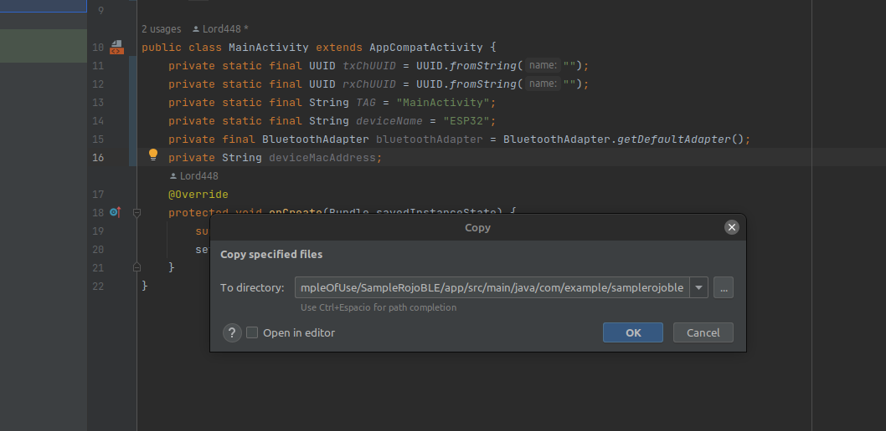

# RojoBLE
This is a java class that will help you to implement and use the BLE on Android Studio

## What will you need?
- A cellphone compatible with Android Studio and minimum the SDK 27, gradle 8.0.2 is also needed
- An ESP32 with MicroPython working

# How to use
### Setting up the classes
- Add to the "AndroidManifest.xml" the following line
```xml
<uses-permission android:name="android.permission.BLUETOOTH_CONNECT" />
```
- Import  the java classes "RojoBLE.java" and "RojoGattCallback.java" in the same directory of "MainActivity.java"

- If Android Studio request a copy permission click "OK"

- Check that the RojoBLE class doesn't have errror, if it appears something like this

- To solve this error just click on "Add permission BLUETOOTH_CONNECT"

### Setting up the code
- Generate random UUIDs [here](https://www.uuidgenerator.net/)
- Declare as "private static  the UUIDs of the device that you will connect
- Declare a Blueetooth Adapter, a String for the Mac Address and a String for the device name (you can do it this way)
```java
private static final String deviceName = "RojoBLE";  
private final BluetoothAdapter bluetoothAdapter = BluetoothAdapter.getDefaultAdapter();  
private String deviceMacAddress;
```
-  Declare an object of RojoBLE (for example: )
```java
//Using a UART type connection
//This way is no needed, you can declare as many RojoBLE objects you need
//Write characteristic  
private RojoBLE rojoTX;  
//Notify characteristic  
private RojoBLE rojoRX;
```
- Inside of the onCreate method you will need to perfom the following actions
- Check if the mobile that you are using supports BLE
```java
if(!RojoBLE.checkBLESupport(this, bluetoothAdapter)) {  
    Toast.makeText(getApplicationContext(), "Your device doesn't support bluetooth", Toast.LENGTH_LONG).show();  
  finish();  
}
```
- Get the Mac Address 
```java
deviceMacAddress = RojoBLE.searchForMacAddress(this, bluetoothAdapter, deviceName);
```
- Handle the null pointer exception if the device Mac Adress string is null (if its null it means that the device that you are searching is not connected)
```java
if(deviceMacAddress == null) {  
  Log.e(TAG, "ESP32 not paired");  
  //Handle here the error  
  Toast.makeText(getApplicationContext(), "Connect the device", Toast.LENGTH_LONG).show();  
  finish();  
}
```
- If the mac address has been found you can proceed to instance the RojoBLE class
```java
else {  
  rojoTX = new RojoBLE(this, rxChUUID, RojoBLE.ROJO_TYPE_WRITE, deviceMacAddress);  
  rojoRX = new RojoBLE(this, txChUUID, RojoBLE.ROJO_TYPE_NOTIFY, deviceMacAddress);
  rojoRX.setOnCharacteristicNotificationListener(this::onCharacteristicNotificationListener);  
}
```
- The RojoBLE constructor has 2 overrides, so that means that you can explore the class and see which constructor is appropiate for your needs
- In this example i'm using the "Context, UUID, int , String" one, so the first argument is the context of the aplication, the second parameter is the characteristic UUID that will communicate the object, the third is one the characteristics type listed below, and the last one the Mac Address
```java
//Possible RojoBLE characteristic types
public static final int ROJO_TYPE_WRITE = 1;  
public static final int ROJO_TYPE_NOTIFY = 2;
```
- And finally if you have a NOTIFY characterisctic you will need to set a listenet
```java
rojoRX.setOnCharacteristicNotificationListener(this::onCharacteristicNotificationListener);
```

```java
public void onCharacteristicNotificationListener(byte[] value) {
	//The data that arrived is value
}
```
- If you want to check or compare strings with the data that arrived, you can use this method
```java
strValue = new String(value, StandardCharsets.UTF_8); //Parsing to string
RojoBLE.compareStrings(strValue, "Sample!")
```
- Or you can use this one
```java
//value is the variable that is on the listener
RojoBLE.compareIncomingData(value, "This is a more efficient way!")
```
- And by here you are able to use the BLE, check the sample for a further compression of the use of this class
# How to setup the sample
### ESP32 Setup
- Clone the repository and open the "SampleOfUse" directory
- Inside of "ESP32Code" will be two python programs: "BLE.py" and "ESP32Sample.py"
- Load this programs to your microcontroller and run "ESP32Sample.py"
### Android Studio Setup
- Open the project located in "SampleRojoBLE" with Android Studio
- Open the RojoBLE class and resolve this error if it appears

- To solve this error just click on "Add permission BLUETOOTH_CONNECT" this will tell the android API that the coder is asking from permission and will add the following line to the Android Manifest
```xml
<uses-permission android:name="android.permission.BLUETOOTH_CONNECT" />
```
- Connect compile and run the program
### Note: This sample have been only tested on a real phone
